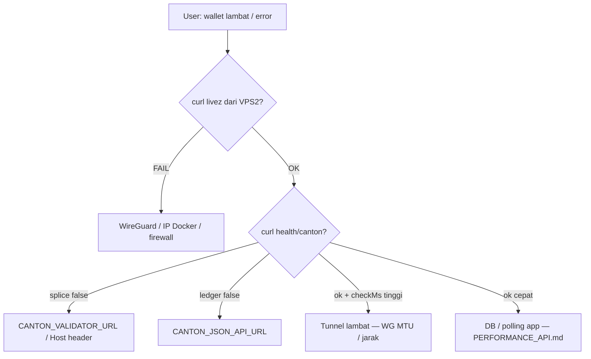

# Koneksi stabil: JSON Ledger API + Splice Validator

> Berdasarkan [Canton JSON Ledger API tutorial](https://docs.canton.network/appdev/modules/m4-json-api-tutorial) dan pola deploy CanQuest ([NETWORK_TOPOLOGY.md](./NETWORK_TOPOLOGY.md)).

## Yang dikatakan dokumentasi Canton

Canton **JSON Ledger API** adalah **HTTP REST** (bukan koneksi TCP panjang yang harus “selalu nyala” di aplikasi).

| Endpoint | Fungsi (production) |
|----------|---------------------|
| `GET /livez` | Health check — **200 = JSON API siap** ([tutorial](https://docs.canton.network/appdev/modules/m4-json-api-tutorial)) |
| `GET /docs/openapi` | Spesifikasi API |
| `POST /v2/commands/submit-and-wait` | Submit transaksi |
| `POST /v2/state/active-contracts` | Query kontrak aktif |

**Splice Validator** memakai endpoint terpisah, mis. `GET /api/validator/v0/readyz` (sudah dipakai di `SpliceValidatorService.isReachable()`).

Artinya: “terputus-putus” di CanQuest biasanya **bukan** karena API Canton butuh WebSocket persisten, melainkan:

1. **Jalur jaringan** VPS 2 → VPS 1 putus (SSH tunnel mati, WireGuard down, IP Docker berubah)
2. **Container** participant / validator restart atau overload
3. **Aplikasi** terlalu sering memanggil Splice (sync balance) sehingga terasa “hang”

---

## Paling ampuh (urutan prioritas)

### 1. WireGuard permanen — bukan SSH tunnel (production)

```
VPS 2 (API)  --WireGuard-->  VPS 1 (Docker Canton)
```

| Metode | Masalah |
|--------|---------|
| **SSH `-L` tunnel** | Putus saat SSH mati / sleep / reconnect |
| **WireGuard + systemd** | Tunnel tetap; `PersistentKeepalive = 25` |

Template: `infra/wireguard/wg0-vps2.conf.example`

```ini
PersistentKeepalive = 25
AllowedIPs = 10.66.66.1/32, 172.17.0.0/16   # subnet Docker VPS 1
```

VPS 2:

```bash
sudo systemctl enable wg-quick@wg0
sudo systemctl start wg-quick@wg0
```

**Matikan** `canton-tunnel.service` (SSH) jika WireGuard sudah jalan — jangan dua jalur sekaligus.

---

### 2. URL stabil di `apps/api/.env` (production)

Saat pakai WireGuard, **jangan** `127.0.0.1:7575` di VPS 2 (itu hanya untuk dev + SSH di laptop).

```env
# IP Docker participant di VPS 1 (docker inspect)
CANTON_JSON_API_URL=http://172.x.x.x:7575

# Nginx validator di VPS 1 — Splice Wallet API
CANTON_VALIDATOR_URL=http://172.x.x.x:80
CANTON_VALIDATOR_HOST_HEADER=wallet.localhost
```

Setelah `docker compose restart` di VPS 1, **IP bisa berubah** → update `.env` + restart PM2.

---

### 3. Health check rutin (sesuai docs Canton)

Dari **VPS 2** (bukan dari laptop):

```bash
# JSON Ledger — dokumentasi resmi
curl -sf http://<PARTICIPANT_IP>:7575/livez && echo " ledger OK"

# Splice
curl -sf -H "Host: wallet.localhost" http://<NGINX_IP>/api/validator/v0/readyz && echo " splice OK"

# CanQuest API (gabungan + timing)
curl -s http://127.0.0.1:3001/api/health/canton
```

Jadwalkan tiap 1–5 menit (cron) — jika gagal, alert + `systemctl restart wg-quick@wg0`.

---

### 4. Docker di VPS 1 — selalu hidup

```bash
docker ps   # participant + validator harus Up
docker update --restart unless-stopped <container_names>
```

Canton log jika error: `<canton_install>/logs/canton.log` (lihat tutorial troubleshooting).

---

### 5. Lapisan aplikasi CanQuest (kurangi “terasa putus”)

Sudah disarankan di `apps/api/.env`:

```env
BALANCE_READ_FROM_DB=true
BALANCE_DB_MAX_AGE_MS=60000
BALANCE_BACKGROUND_DEBOUNCE_MS=15000
```

- **GET /party/balance** → DB dulu, sync chain di background  
- **Retry** pada contention sudah ada di `CantonLedgerService.submitCommand` (Module 7)  
- **Inbound sync** jangan terlalu agresif: `CC_INBOUND_SYNC_POLL_MS=30000` atau lebih

Ini tidak membuat tunnel lebih stabil, tapi **UI tidak macet** saat Canton lambat 2–5 detik.

---

## Alur diagnosa saat “putus”



---

## Dev lokal vs production

| Lingkungan | Jalur |
|------------|--------|
| Laptop dev | `scripts/tunnel-testnet.ps1` → `127.0.0.1:7575` |
| VPS 2 prod | WireGuard → IP Docker VPS 1 |

Tutorial Canton memakai `localhost:7575` karena **sandbox di satu mesin** — di CanQuest, “localhost” hanya valid **di dalam VPS 1** atau **lewat tunnel ke VPS 1**.

---

## Referensi

- [Canton JSON Ledger API tutorial](https://docs.canton.network/appdev/modules/m4-json-api-tutorial) — `livez`, `submit-and-wait`, troubleshooting `curl -v`
- [NETWORK_TOPOLOGY.md](./NETWORK_TOPOLOGY.md) — WireGuard vs SSH
- [PERFORMANCE_API.md](./PERFORMANCE_API.md) — diagnosa lambat dari sisi API
